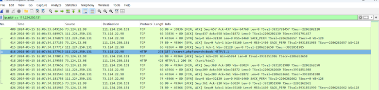
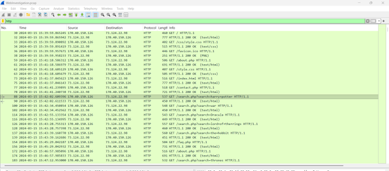
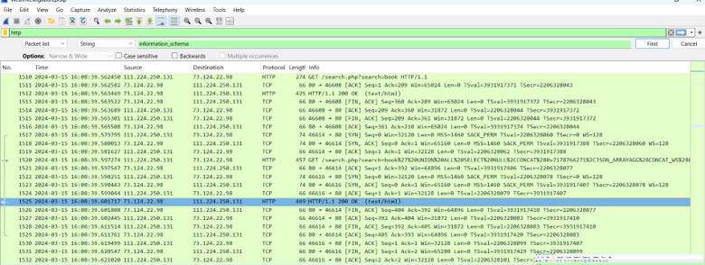
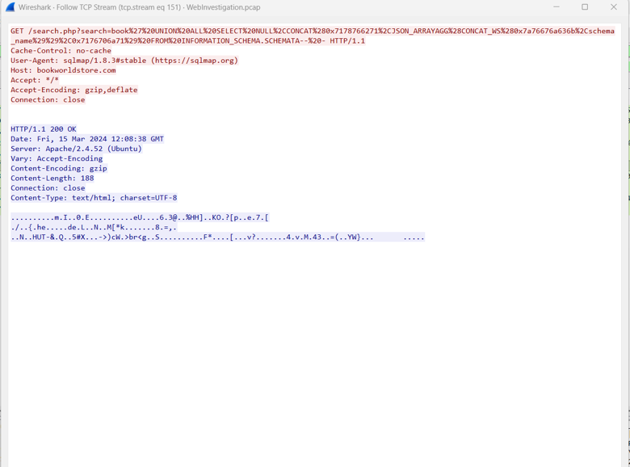
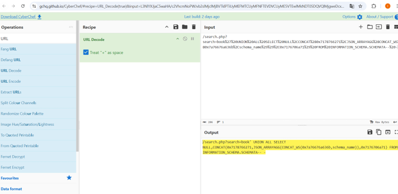
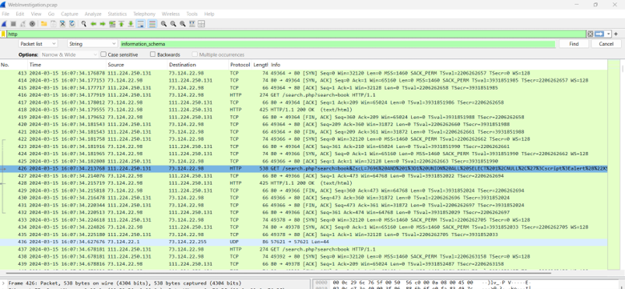
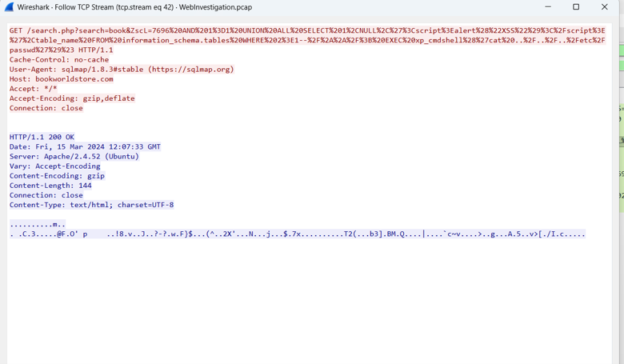
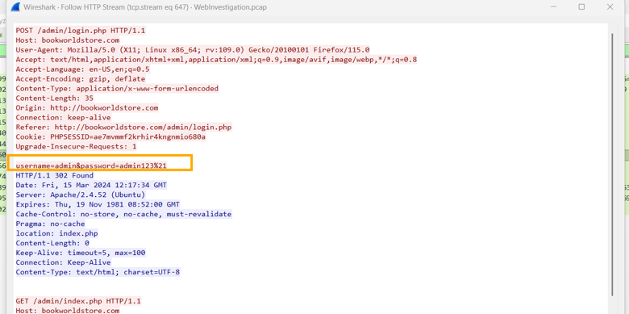
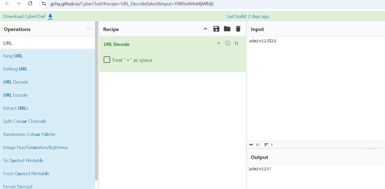
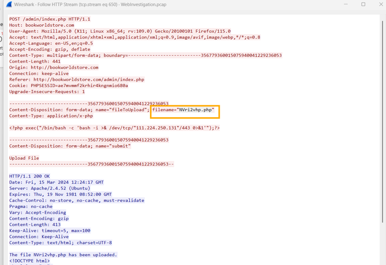

# Introduction:

This investigation focuses on analyzing captured network traffic to identify and understand a potential compromise of a web server. Using Wireshark, the network packets are examined to detect signs of malicious activity within the HTTP communication. The analysis aims to identify evidence of a SQL Injection attack, uncover any credentials used by the attacker, and determine whether malicious files were uploaded to the server. Through this investigation, the goal is to reconstruct the attack sequence and assess the extent

# Investigation Methodology:

·       Using Wireshark to  Network traffic analysis

·       HTTP request analysis

·       SQL injection pattern detection

·       Decode URL using CyberChef

·       Decode password using CyberChef

# Timeline of the Attack

| **Time**     | **Event**                                                                                                                                               |
| ------------ | ------------------------------------------------------------------------------------------------------------------------------------------------------- |
| **15:39:57** | The attacker connected to the web server from IP address 111.224.250.131                                                                                |
| **15:39:59** | Establish an HTTP connection with the web server                                                                                                        |
| **15:39:59** | Send the first HTTP request to the file /search.php                                                                                                     |
| **15:40:02** | First SQL Injection attempt discovered using query /search.php?search=book and 1=1                                                                      |
| **15:40:05** | The attacker performed a database exploration operation using UNION SELECT. The attacker performed a database exploration operation using UNION SELECT. |
| **15:40:09** | Extracting database names from the INFORMATION_SCHEMA table                                                                                             |
| **15:40:15** | Identify the customers table that contains user data                                                                                                    |
| **15:40:22** | Discover the hidden folder /admin/                                                                                                                      |
| **15:40:30** | Attempting to log in using the credentials admin:admin123!                                                                                              |
| **15:40:45** | Uploading a malicious PHP file named NVri2vhp.php to the server                                                                                         |

# Attack Analysis

Network activity was analyzed using Wireshark. It was discovered that the "BookWorld" web server was under attack from "111.224.250.131". The attack began with the attacker sending HTTP requests to the PHP file "search.php". This file was then exploited through SQL injection, manipulating the search value sent to the database.

This injection allows the attacker to communicate directly with the database in the background using queries such as UNION SELECT. The attacker can then explore the database structure and extract information about existing databases.

Analysis revealed that the attacker was able to access the INFORMATION_SCHEMA database and obtain information about the database structure and its various tables. They were also able to identify the table containing user data, namely "customers".

Through this, the attacker found a hidden folder called /admin/ containing the site's control panel. The attacker then successfully logged into the admin panel using the login credentials admin:admin123!

The attacker uploaded a malicious PHP file named NVri2vhp.php to the server after gaining administrative privileges. This file acts as a web shell, allowing it to execute commands remotely.

# Evidence

1-Attacker IP Address

 The malicious activity originates from IP address:111.224.250.131

2-HTTP Stream

The images show the flow of HTTP traffic between the client and the web server bookworldstore.com, where the browser is used to send a GET request to the file search.php with the search value harrypotter

3-SQL injection payload

These images illustrate the attacker's attempt to perform SQL Injection to exploit the search.php file.

  

4-Database Enumeration

The attacker used SQL Injection to extract information from the tables in the database. The attacker used a UNION ALL SELECT query to access the information_schema.tables table, which contains information about all the tables in the database.

  

5-Login credentials     

The network traffic indicates that the attacker made several attempts before sending the correct login data via an HTTP POST request to the site's admin panel.

  

4-upload request

The attacker uploaded a malicious PHP file to the server by making an HTTP POST request to the /admin/index.php page through multipart/form-data to upload files.

IOCs:

IP attacker: 111.224.250.131

Exploited Script: search.php

Suspicious File Uploaded: NVri2vhp.php

Stolen Credentials: admin:admin123!

Private Directory: /admin/

Attack Method: SQL Injection